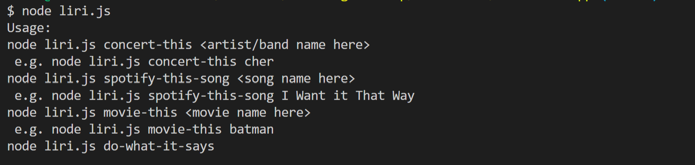
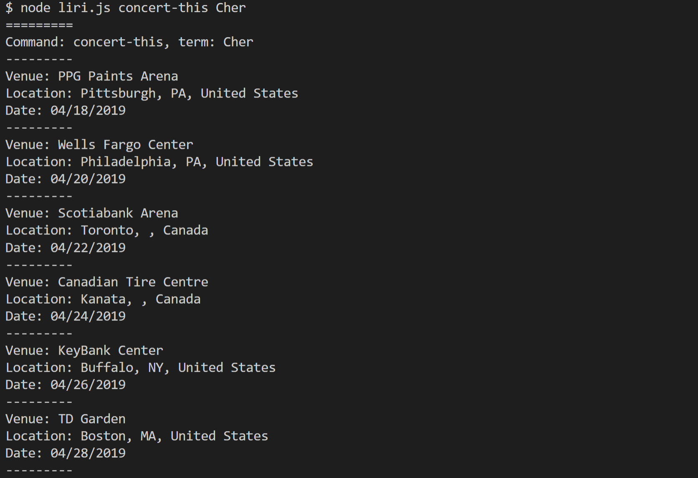
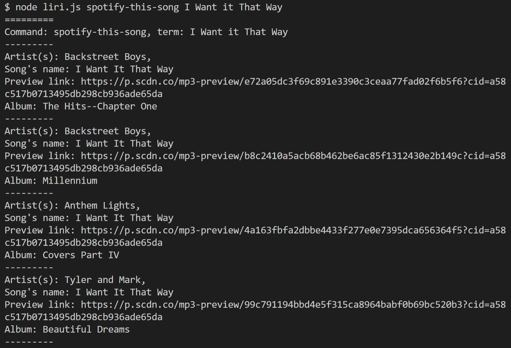
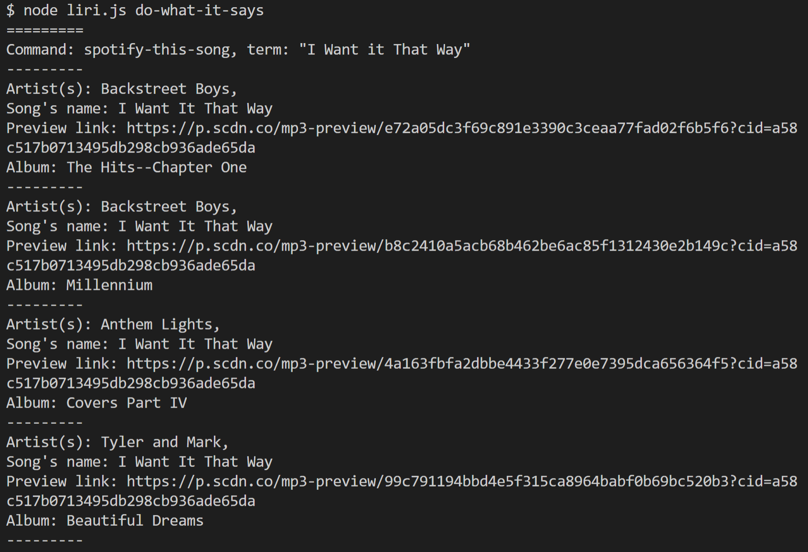

# liri-node-app

## Description

 A simple implementation of the Language Interpretation and Recognition Interface (LIRI) as a command line Node.js application. Uses following API's to search for info about concerts, songs, and movies: [Bandsintown API](http://www.artists.bandsintown.com/bandsintown-api), [OMDb API](http://www.omdbapi.com/), and [Spotify API](https://developer.spotify.com/).

## How to use

Clone the repository to a local folder and install the dependencies with `npm install`. Requires `Node.js`.

1. Usage  
   `node liri.js`

    

2. Concert This  
   `node liri.js concert-this <artist/band name here>`  
   e.g. `node liri.js concert-this Cher`

    

3. Spotify This Song  
   `node liri.js spotify-this-song <song name here>`  
   e.g. `node liri.js spotify-this-song I Want it That Way`

    

4. Movie This  
   `node liri.js movie-this <movie name here>`  
   e.g. `node liri.js movie-this Batman`

    

5. Do What It Says  
   `node liri.js do-what-it-says`

    
